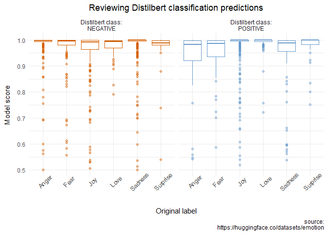

<!-- README.md is generated from README.Rmd. Please edit that file -->

# huggingfaceR

<!-- badges: start -->
<!-- badges: end -->

The goal of `huggingfaceR` is to to bring state-of-the-art NLP models to
R. `huggingfaceR` is built on top of Hugging Face’s
[transformers](https://huggingface.co/docs/transformers/index) library;
and has support for navigating the Hugging Face Hub [The
Hub](https://huggingface.co/models).

## Installation

Prior to installing `huggingfaceR` please be sure to have your python
environment set up correctly.

``` r
install.packages("reticulate")
library(reticulate)

install_miniconda()
```

If you are having issues, more detailed instructions on how to install
and configure python can be found
[here](https://support.rstudio.com/hc/en-us/articles/360023654474-Installing-and-Configuring-Python-with-RStudio).

After that you can install the development version of huggingfaceR from
[GitHub](https://github.com/) with:

``` r
# install.packages("devtools")
devtools::install_github("farach/huggingfaceR")
```

## Example

`huggingfaceR` makes use of the `transformers` `pipline()` abstraction
to quickly make pre-trained language models available for use in R. In
this example we will load the
`distilbert-base-uncased-finetuned-sst-2-english` model and its
tokenizer into a pipeline object to obtain sentiment scores.

``` r
library(huggingfaceR)

distilBERT <- hf_load_pipeline(
  model_id = "distilbert-base-uncased-finetuned-sst-2-english", 
  task = "text-classification"
  )
#> 
#> 
#> distilbert-base-uncased-finetuned-sst-2-english is ready for text-classification

distilBERT
#> <transformers.pipelines.text_classification.TextClassificationPipeline object at 0x000001D0A8F71510>
```

With the pipeline now loaded, we can begin using the model.

``` r
distilBERT("I like you. I love you")
#> [[1]]
#> [[1]]$label
#> [1] "POSITIVE"
#> 
#> [[1]]$score
#> [1] 0.9998739
```

We can use this pipeline in a typical tidyverse processing chunk. First
we load the `tidyverse`.

``` r
library(tidyverse)
#> ── Attaching packages ─────────────────────────────────────── tidyverse 1.3.2 ──
#> ✔ ggplot2 3.4.0      ✔ purrr   1.0.0 
#> ✔ tibble  3.1.8      ✔ dplyr   1.0.10
#> ✔ tidyr   1.2.1      ✔ stringr 1.5.0 
#> ✔ readr   2.1.3      ✔ forcats 0.5.2 
#> ── Conflicts ────────────────────────────────────────── tidyverse_conflicts() ──
#> ✖ dplyr::filter() masks stats::filter()
#> ✖ dplyr::lag()    masks stats::lag()
```

We can use the `huggingfaceR` `hf_load_dataset()` function to pull in
the [emotion](https://huggingface.co/datasets/emotion) Hugging Face
dataset. This dataset contains English Twitter messages with six basic
emotions: anger, fear, love, sadness, and surprise. We are interested in
how well the Distilbert model classifies these emotions as either a
positive or a negative sentiment.

``` r
emo <- hf_load_dataset(
  dataset = "emo", 
  split = "train", 
  as_tibble = TRUE, 
  label_name = "int2str"
  )

emo_model <- emo %>%
  sample_n(100) %>% 
  transmute(
    text,
    emotion_id = label,
    emotion_name = label_name,
    distilBERT_sent = distilBERT(text)
  ) %>%
  unnest_wider(distilBERT_sent)

glimpse(emo_model)
#> Rows: 100
#> Columns: 5
#> $ text         <chr> "on hotstar thanks found it whom u hate much", "what so g…
#> $ emotion_id   <dbl> 0, 3, 3, 2, 1, 3, 0, 3, 2, 1, 0, 0, 0, 0, 1, 0, 2, 3, 1, …
#> $ emotion_name <chr> "others", "angry", "angry", "sad", "happy", "angry", "oth…
#> $ label        <chr> "NEGATIVE", "POSITIVE", "NEGATIVE", "NEGATIVE", "NEGATIVE…
#> $ score        <dbl> 0.9737250, 0.9995377, 0.9959581, 0.9969825, 0.9984096, 0.…
```

We can use `ggplot2` to visualize the results.

``` r
emo_model |>
  mutate(
    label = paste0("Distilbert class:\n", label),
    emotion_name = str_to_title(emotion_name)
  ) |>
  ggplot(aes(x = emotion_name, y = score, color = label)) +
  geom_boxplot(show.legend = FALSE, outlier.alpha = 0.4, ) +
  scale_color_manual(values = c("#D55E00", "#6699CC")) +
  facet_wrap(~ label) +
  labs(
    title = "Reviewing Distilbert classification predictions",
    x = "Original label",
    y = "Model score",
    caption = "source:\nhttps://huggingface.co/datasets/emo"
  ) +
  theme_minimal() +
  theme(
    plot.title = element_text(hjust = 0.5),
    axis.text.x = element_text(angle = 45),
    axis.title.y = element_text(margin = margin(t = 0, r = 10, b = 0, l = 0)),
    axis.title.x = element_text(margin = margin(t = 10, r = 0, b = 0, l = 0))
  )
```


