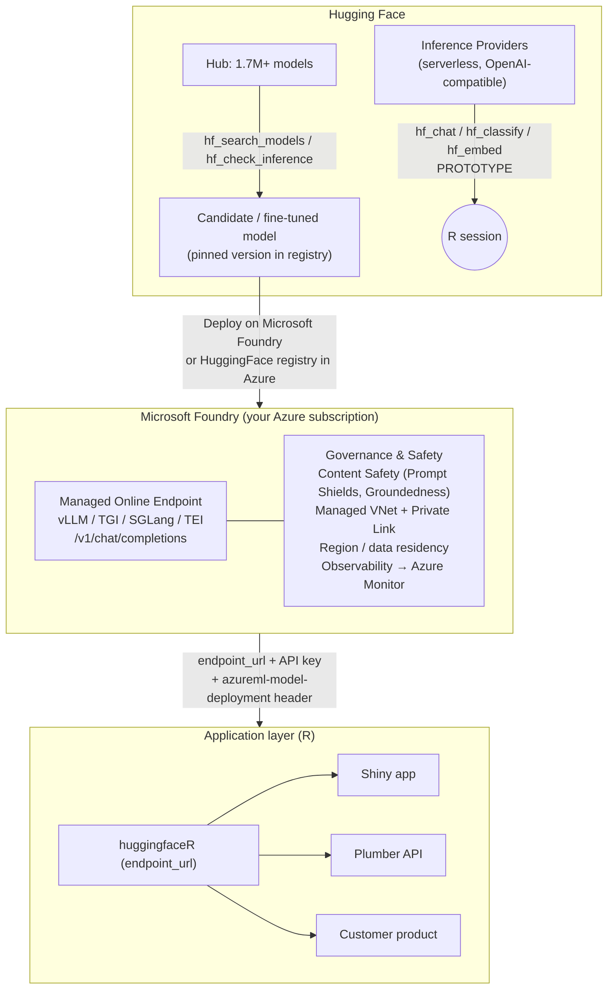

# From R Session to Governed Production: The Hugging Face → Microsoft Foundry Pipeline

> Capstone narrative chapter for the `huggingfaceR` book.
> Audience: R programmers and R-centric data science teams who are comfortable with
> the tidyverse and Shiny/Plumber, but are **not** career MLOps engineers.
>
> The arc this chapter builds toward:
>
> ```
> Hugging Face  →  find / fine-tune model  →  Microsoft Foundry  →  secure deployment + monitoring  →  employee / customer application
> ```

All platform-specific claims in this chapter are cited inline with source URLs. Facts
about Microsoft / Azure capabilities were verified against current (2026) documentation;
a list of anything that could not be fully verified appears at the very end.

---

## 1. The problem: "it works in my R session" is not production

Everything in the first chapters of this book has the same shape. You open R, set
`HUGGING_FACE_HUB_TOKEN`, and a single function call reaches across the internet to a
shared, multi-tenant inference service and comes back with a tibble:

```r
library(huggingfaceR)

hf_classify(
  "The renewal pricing is outrageous and support never replied.",
  model = "distilbert-base-uncased-finetuned-sst-2-english"
)
#> # A tibble: 1 x 3
#>   text                                        label    score
#>   <chr>                                       <chr>    <dbl>
#>   The renewal pricing is outrageous and supp… NEGATIVE 0.998
```

This is wonderful for analysis, exploration, and prototyping. It is also, quietly, a
*production anti-pattern* the moment a real business process starts to depend on it.
The serverless path you used to prototype — Hugging Face's **Inference Providers**, a
single OpenAI-compatible API that routes your request to one of 15+ partner providers on
pass-through pricing ([huggingface.co/docs/inference-providers](https://huggingface.co/docs/inference-providers/index)) —
is optimized for *getting an answer*, not for *being accountable for the answer*.

The gap between "it returned a tibble in my session" and "this is a governed production
deployment" is made of second-order concerns that never show up in a demo and always
show up in an audit:

| Concern | Why your R session doesn't address it | What a governed deployment must answer |
|---|---|---|
| **Data residency** | Your prompt is sent to whatever region/provider the router picks. | "Customer data never leaves region X" must be provable. |
| **PII** | Free text (support tickets, clinical notes, HR cases) leaves your boundary as-is. | PII must be controlled, logged, or never exposed to a third party. |
| **Auditability** | There is no durable, queryable record of who asked what, when, and what came back. | Every request/response is traceable for compliance and incident review. |
| **Cost** | Pass-through, per-token billing is invisible until the monthly bill lands. | Cost is attributable to a team/app and forecastable. |
| **Rate limits** | Shared serverless capacity throttles you under load, unpredictably. | Capacity is reserved and SLA-backed. |
| **Uptime / SLA** | Best-effort. A provider can deprecate or rate-limit a model. | A contractual SLA and a controlled change process exist. |
| **Model versioning** | "latest" silently changes underneath you. | A specific, pinned model version is deployed and promotable. |
| **Drift / monitoring** | You find out quality dropped when a user complains. | Quality, safety, latency, and token use are measured continuously. |

None of this means the serverless API was the wrong choice. It was the *right* choice
for stages 1 and 2 below. The point of this chapter is that **the same R code you
prototyped with can graduate** — with minimal change — onto infrastructure that answers
the table above. That infrastructure, in the architecture this book recommends, is
**Microsoft Foundry** (the platform formerly called Azure AI Foundry; it was renamed at
Microsoft Ignite 2025 into a unified Azure platform-as-a-service for enterprise AI
([huggingface.co/docs/microsoft-azure/foundry/introduction](https://huggingface.co/docs/microsoft-azure/en/foundry/introduction))).

---

## 2. The pipeline, stage by stage

The pipeline has five stages. At each one, this section names the role R and
`huggingfaceR` play, so an R team can see exactly *where they own the work* and where they
*hand off* to a platform.

```
  [1] Discover & prototype   [2] Fine-tune        [3] Deploy & govern     [4] Consume from R     [5] Application layer
       on Hugging Face   →    on the Hub      →    on Microsoft Foundry →   (endpoint_url)     →   (Shiny / Plumber / product)
       (huggingfaceR)         (model lands             (managed endpoint,      (huggingfaceR,        (employees / customers)
                               in registry)            content safety,         OpenAI-compatible)
                                                       monitoring, network)
```

### Stage 1 — Discovery & prototyping on Hugging Face, from R

This is `huggingfaceR`'s home turf, and it is where an R team spends its first days. The
goal is to answer a research question — *does an open model solve our problem well enough
to be worth productionizing?* — entirely in R, against tibbles, with no Python and no
cloud account.

**Find candidate models.** `hf_search_models()` queries the Hub's 1.7M+ public models
([huggingface.co/docs/microsoft-azure/foundry/introduction](https://huggingface.co/docs/microsoft-azure/en/foundry/introduction))
by task, author, language, library, tags, and popularity, returning a tibble you can
`filter()` and `arrange()` like any other:

```r
hf_search_models(task = "text-classification", search = "sentiment",
                 sort = "downloads", limit = 10)
```

**Check that a model is actually servable** before you build anything on it, with
`hf_check_inference()`:

```r
hf_check_inference("distilbert-base-uncased-finetuned-sst-2-english")
```

**Prototype the real workload** with the task verbs. These all return tibbles and all
hit the serverless Inference Providers API by default:

```r
hf_classify(tickets$body, model = "...")          # text classification
hf_embed(tickets$body)                            # sentence embeddings -> matrix/tibble
hf_extract_topics(tickets, text)                  # topic extraction over a data frame
hf_chat("Summarize this ticket: ...")             # OpenAI-compatible chat
```

At the end of Stage 1 you have an evidence-backed decision: *this specific model, on this
task, is good enough.* You have made it entirely in R. Nothing is in production yet, and
that is correct — see the decision guide in Section 4 before you spend a dollar on
dedicated infrastructure.

### Stage 2 — Fine-tuning: where it happens and how an R team participates

Most R teams do not write training loops, and they don't need to. Fine-tuning is the one
stage where the *heavy lifting* is usually not in R, and being honest about that is part
of writing for this audience. There are three realistic paths, in increasing order of R
ownership:

1. **No fine-tune (most common).** A well-chosen base model from Stage 1 is good enough.
   Skip to Stage 3. Do not fine-tune to feel thorough; it adds a versioned artifact you
   now have to govern.
2. **Fine-tune elsewhere, govern from R.** A colleague (or an AutoML/training service)
   produces a fine-tuned model. The R team's job is to *evaluate* it (re-run the Stage 1
   tibble-based benchmarks against the new checkpoint) and to *track its lineage*. The
   `huggingfaceR` Hub functions let an R user inspect and pull model metadata so the
   evaluation and the model card stay in the same R analysis.
3. **R-driven fine-tune.** Where the team has Python-capable members, training runs can
   be orchestrated and the *resulting weights pushed to the Hub*, or directly into a
   registry. Either way, the contract for the next stage is the same.

**The handoff artifact, regardless of path, is a model with a pinned version living in a
registry** — either:

- the **Hugging Face Hub** (a public or private/gated repo with versioned weights), or
- the **`HuggingFace` registry inside Azure**, which mirrors 11,000+ of the most popular
  Hub models as "secure and verified weights" deployable in a few clicks
  ([huggingface.co/docs/microsoft-azure/foundry/introduction](https://huggingface.co/docs/microsoft-azure/en/foundry/introduction)).

This is the crucial conceptual move: **fine-tuning ends not with a file on someone's
laptop, but with a versioned, addressable model in a registry.** That is what makes
Stage 3 a button-press rather than a research project.

### Stage 3 — Handoff to Microsoft Foundry for secure deployment + monitoring

This is the stage that answers the entire table in Section 1. Microsoft and Hugging Face
have a standing partnership (expanded at Microsoft Build 2025) that brings open-source
Hub models into Microsoft Foundry and Azure Machine Learning
([huggingface.co/docs/microsoft-azure/foundry/introduction](https://huggingface.co/docs/microsoft-azure/en/foundry/introduction)).
There are two ways a Hub model gets there:

- **One-click from the Hub.** On a supported model's Hub page, choose **"Deploy on
  Microsoft Foundry"**, which brings you into Azure with secure, scalable inference
  pre-configured ([huggingface.co/docs/microsoft-azure/foundry/introduction](https://huggingface.co/docs/microsoft-azure/en/foundry/introduction)).
- **From the Foundry model catalog.** Browse the `HuggingFace` collection in the
  Foundry / Azure ML catalog and deploy. As of March 2026, Foundry supports more than
  11,000 models including over 3,000 from Hugging Face
  ([learn.microsoft.com — Foundry Models overview](https://learn.microsoft.com/en-us/azure/foundry/concepts/foundry-models-overview)).

**Deployment options.** Foundry offers two deployment shapes
([learn.microsoft.com — deployment options](https://learn.microsoft.com/en-us/azure/foundry-classic/concepts/deployments-overview)):

- **Managed compute (Managed Online Endpoint).** You deploy onto dedicated CPU/GPU
  instances in *your* Azure subscription; the platform handles serving, scaling,
  securing, and monitoring, and exposes a secure REST API for real-time scoring. This is
  the path used for open Hugging Face models, powered by open inference engines (vLLM,
  TGI, SGLang for LLMs/VLMs; TEI for embeddings)
  ([huggingface.co/docs/microsoft-azure/foundry/introduction](https://huggingface.co/docs/microsoft-azure/en/foundry/introduction)).
- **Serverless API (a.k.a. standard / MaaS).** Pay-as-you-go, token-billed, no GPU to
  provision — but not every Hub model is offered this way
  ([learn.microsoft.com — deployment options](https://learn.microsoft.com/en-us/azure/foundry-classic/concepts/deployments-overview)).

Mechanically, deploying a Hub LLM as a managed endpoint looks like the snippet below
(Python SDK; the *equivalent one-click flow exists in the portal*). Note the model URI
form `azureml://registries/HuggingFace/models/<name>/labels/latest` and the
OpenAI-compatible `/v1/chat/completions` route the endpoint exposes — that detail is what
makes Stage 4 trivial for R
([huggingface.co/docs/microsoft-azure/foundry/examples/deploy-large-language-models](https://huggingface.co/docs/microsoft-azure/en/foundry/examples/deploy-large-language-models)):

```python
# Azure ML / Foundry SDK — this is the ONE part an R team typically does not write
from azure.ai.ml.entities import ManagedOnlineEndpoint, ManagedOnlineDeployment

deployment = ManagedOnlineDeployment(
    name="qwen-deployment",
    endpoint_name="qwen-endpoint",
    model="azureml://registries/HuggingFace/models/qwen-qwen2.5-32b-instruct/labels/latest",
    instance_type="Standard_NC40ads_H100_v5",
    instance_count=1,
)
```

**What Foundry adds that the open serverless API does not** — this is the heart of the
chapter:

- **Dedicated, SLA-backed capacity** in your own subscription and region (vs. shared,
  best-effort serverless capacity).
- **Network isolation.** A Microsoft-managed virtual network plus Private Link / private
  endpoints keep traffic off the public internet; PaaS components (project, storage, Key
  Vault, registry, monitoring) are isolated with Private Link
  ([learn.microsoft.com — managed virtual network](https://learn.microsoft.com/en-us/azure/foundry/how-to/managed-virtual-network),
  [learn.microsoft.com — network isolation / private link](https://learn.microsoft.com/en-us/azure/foundry/how-to/configure-private-link)).
- **Data residency control.** You choose the region, and cross-region private endpoints
  let an app in a data-resident region consume inference in another over Azure's backbone
  without data leaving its compliant region
  ([techcommunity — private networking and inference](https://techcommunity.microsoft.com/blog/azure-ai-foundry-blog/private-networking-and-inference-in-microsoft-foundry-architecture-impact-on-ent/4513822)).
- **Content safety guardrails.** Azure AI Content Safety adds **Prompt Shields**
  (against direct/indirect prompt-injection and jailbreaks), **Groundedness detection**
  (flags ungrounded/hallucinated output against source data), protected-material
  detection, and configurable content filtering
  ([learn.microsoft.com — Content Safety overview](https://learn.microsoft.com/en-us/azure/foundry-classic/ai-services/content-safety-overview),
  [azure.microsoft.com — Content Safety](https://azure.microsoft.com/en-us/products/ai-services/ai-content-safety)).
- **Observability that became generally available in 2026.** Foundry observability is
  built around four capabilities — **Trace, Evaluate, Monitor, Optimize** — with
  distributed tracing on OpenTelemetry, integrated with **Azure Monitor Application
  Insights**; evaluation/monitoring/tracing reached GA in March 2026
  ([learn.microsoft.com — Observability](https://learn.microsoft.com/en-us/azure/foundry/concepts/observability),
  [techcommunity — GA announcement](https://techcommunity.microsoft.com/blog/azure-ai-foundry-blog/generally-available-evaluations-monitoring-and-tracing-in-microsoft-foundry/4502760)).
- **Gated-model governance.** Foundry supports gated Hugging Face models by integrating
  directly with the user's Hugging Face access token, keeping you aligned with each
  provider's licensing
  ([techcommunity — gated models in Foundry](https://techcommunity.microsoft.com/blog/azure-ai-foundry-blog/unlocking-hugging-face-gated-models-in-microsoft-foundry/4485722)).

In short: Foundry is where the second-order concerns from Section 1 stop being your
personal responsibility and become *platform features you configure*.

### Stage 4 — Consuming the governed Foundry endpoint, from R

Here is the payoff for an R team, and the reason this whole pipeline is realistic rather
than aspirational. A Foundry managed endpoint running a Hugging Face LLM **exposes an
OpenAI-compatible `/v1/chat/completions` route**
([huggingface.co/docs/microsoft-azure/foundry/examples/deploy-large-language-models](https://huggingface.co/docs/microsoft-azure/en/foundry/examples/deploy-large-language-models)).
`huggingfaceR` already speaks exactly that protocol and already exposes an
`endpoint_url` parameter on its chat functions.

Recall how `hf_chat()` chooses its URL — when `endpoint_url` is supplied it appends
`/v1/chat/completions` and points there instead of the public router:

```r
# Prototype (Stage 1): public serverless router
hf_chat("Summarize this ticket", model = "meta-llama/Llama-3.1-8B-Instruct")

# Production (Stage 4): the SAME function, pointed at the governed Foundry endpoint
hf_chat(
  "Summarize this ticket",
  model       = "Qwen/Qwen2.5-32B-Instruct",
  endpoint_url = "https://qwen-endpoint.eastus.inference.ml.azure.com",
  token        = Sys.getenv("FOUNDRY_API_KEY")   # Foundry endpoint key, not your HF token
)
```

That is the entire migration for the calling code: **change a URL and a token.** The
business logic, the tibble outputs, the Shiny wiring — all unchanged. `hf_conversation()`
takes the same `endpoint_url`, so multi-turn flows move identically.

Two honest caveats for the R implementer:

- **Auth differs.** The serverless API uses your Hugging Face bearer token; the Foundry
  endpoint uses its own API key (the endpoint's primary key)
  ([huggingface.co/docs/microsoft-azure/foundry/examples/deploy-large-language-models](https://huggingface.co/docs/microsoft-azure/en/foundry/examples/deploy-large-language-models)).
  `endpoint_url` + `token` already cover this.
- **The deployment header.** Foundry managed endpoints expect an extra HTTP header,
  `azureml-model-deployment: <DEPLOYMENT_NAME>`, on each request to target a specific
  deployment behind the endpoint
  ([huggingface.co/docs/microsoft-azure/foundry/examples/deploy-large-language-models](https://huggingface.co/docs/microsoft-azure/en/foundry/examples/deploy-large-language-models)).
  If an endpoint has a single default deployment this is often optional; for multi-
  deployment endpoints it is required. **This is the one place `huggingfaceR` may need a
  small enhancement** — a `headers` pass-through on `hf_chat()`/`hf_conversation()`. The
  underlying `httr2` request already supports it; surfacing it is a minor change. (See
  the "could not verify" note at the end regarding whether single-deployment endpoints
  strictly require this header.)

### Stage 5 — The employee / customer application layer

The application that consumes the governed endpoint is, for an R team, the most natural
part of all — because R already has excellent application frameworks:

- **Shiny** for an internal employee tool (e.g., a support-triage console where each
  ticket is summarized and classified by calling `hf_chat()`/`hf_classify()` against the
  Foundry endpoint). Shiny apps can run on Azure (App Service / Container Apps), keeping
  the app and the endpoint inside the same network boundary.
- **Plumber** for a governed internal REST API that wraps the endpoint, so non-R teams
  consume *your* contract while you keep the model call, content-safety policy, and
  logging in one place.
- **A downstream product** (a CRM plugin, a customer-facing assistant) that calls the
  Plumber API or the Foundry endpoint directly.

The key architectural rule: the application calls the **governed Foundry endpoint**,
never the public serverless API. Everything that makes the deployment auditable, safe,
and SLA-backed lives behind that URL, so the app inherits those properties for free. The
R code inside the app is the same code the team wrote in Stage 1.

---

## 3. Reference architecture

### ASCII

```
┌──────────────────────────────────────────────────────────────────────────────────┐
│                                HUGGING FACE                                         │
│                                                                                    │
│   Hub (1.7M+ models)        Inference Providers (serverless, OpenAI-compatible)     │
│        │                              ▲                                             │
│        │ hf_search_models()          │ hf_chat / hf_classify / hf_embed (prototype) │
│        │ hf_check_inference()        │                                             │
│        ▼                              │                                             │
│   Candidate / fine-tuned model  ──────┘                                             │
│   (pinned version in a registry)                                                    │
└───────────────┬────────────────────────────────────────────────────────────────--─┘
                │  "Deploy on Microsoft Foundry"  /  HuggingFace registry in Azure
                ▼
┌──────────────────────────────────────────────────────────────────────────────────┐
│                            MICROSOFT FOUNDRY (your Azure subscription)              │
│                                                                                    │
│   ┌────────────────────────────┐   ┌──────────────────────────────────────────┐   │
│   │  Managed Online Endpoint    │   │  Governance & safety                      │   │
│   │  (vLLM / TGI / SGLang / TEI)│   │  • Azure AI Content Safety                │   │
│   │  exposes /v1/chat/completions│  │    (Prompt Shields, Groundedness)         │   │
│   │  dedicated GPU/CPU, SLA      │   │  • Managed VNet + Private Link            │   │
│   └──────────────┬─────────────┘   │  • Region / data-residency control        │   │
│                  │                  │  • Observability: Trace/Evaluate/Monitor  │   │
│                  │                  │    → Azure Monitor / App Insights         │   │
│                  │                  └──────────────────────────────────────────┘   │
└──────────────────┼─────────────────────────────────────────────────────────────---┘
                   │  endpoint_url + API key (+ azureml-model-deployment header)
                   ▼
┌──────────────────────────────────────────────────────────────────────────────────┐
│                              APPLICATION LAYER (R)                                  │
│                                                                                    │
│   huggingfaceR with endpoint_url ──►  Shiny app  /  Plumber API  /  product         │
│                                       (employees & customers)                       │
└──────────────────────────────────────────────────────────────────────────────────┘
```

### Mermaid



---

## 4. Decision guide: serverless HF, dedicated HF endpoint, or Foundry?

Three tiers, three questions. Move down the table only when the row's trigger is true —
do not graduate prematurely.

| Use… | When | Why | Source |
|---|---|---|---|
| **HF serverless (Inference Providers)** | Prototyping, analysis, internal experiments, bursty/low-volume, no compliance constraints. | Zero infra, pay only per token, OpenAI-compatible, instant. The whole point of Stage 1. | [Inference Providers](https://huggingface.co/docs/inference-providers/index) |
| **HF dedicated Inference Endpoint** | Production on a *single* model with steady-ish load, you want a reservable, SLA-backed, SOC 2-compliant endpoint, scale-to-zero, but you are **not** required to keep everything inside an Azure/enterprise boundary. | Dedicated auto-scaling GPU you choose; per-minute billing with scale-to-zero; OpenAI-compatible. Cheaper and simpler than a full cloud platform when governance demands are moderate. | [endpoints.huggingface.co](https://endpoints.huggingface.co/) |
| **Microsoft Foundry managed endpoint** | You need network isolation / private endpoints, data-residency guarantees, centralized content safety, enterprise observability tied to Azure Monitor, identity/RBAC, gated-model governance, or you are already an Azure shop. | Foundry adds exactly the Section-1 table: VNet + Private Link, region control, Content Safety, Trace/Evaluate/Monitor, all in your subscription. | [Foundry Models overview](https://learn.microsoft.com/en-us/azure/foundry/concepts/foundry-models-overview), [Observability](https://learn.microsoft.com/en-us/azure/foundry/concepts/observability) |

Rules of thumb:

- **Bursty + tiny traffic with long idle?** Stay serverless — a dedicated endpoint that
  sits idle is wasted money ([Inference Providers / Endpoints guidance](https://huggingface.co/docs/inference-providers/index)).
- **One model, steady load, moderate governance?** A dedicated HF Endpoint is the
  sweet spot.
- **Compliance, network isolation, or "we're an Azure enterprise"?** Foundry. The fact
  that `huggingfaceR` already supports `endpoint_url` means this graduation costs the R
  team a URL change, not a rewrite.

---

## 5. Honest tradeoffs: open ecosystem vs. managed platform

These two worlds are often framed as a competition. They are better understood as the
two ends of one pipeline, and the honest tradeoffs are:

**What you gain from the Hugging Face side (openness, portability, cost):**

- **Choice and openness.** 1.7M+ open models, transparent weights, open inference engines
  (vLLM, SGLang, TGI, TEI). You are never locked to one vendor's model menu.
- **Portability.** The OpenAI-compatible interface is the same whether you call the
  serverless router or a self-hosted engine, so your R code is not welded to a provider.
- **Cost at low scale.** Pass-through serverless pricing and scale-to-zero dedicated
  endpoints mean you pay roughly for what you use, with no platform floor.
- **Speed of iteration.** No cloud account, no quota requests, no networking — you can be
  testing a model in R in minutes.

**What you gain from the Microsoft Foundry side (governance, security, support):**

- **Governance and compliance** as configurable features: network isolation, data
  residency, RBAC, audit, gated-model licensing alignment.
- **Safety** as a platform service (Content Safety: Prompt Shields, Groundedness).
- **Observability** wired into the enterprise's existing Azure Monitor / App Insights
  stack — the same place the rest of the org's telemetry already lives.
- **Support and SLA** — a contractual relationship and a controlled change process, which
  matters the moment a customer-facing process depends on the model.

**The cost of each:**

- The open path's cost is *responsibility*: you own the second-order concerns from
  Section 1 yourself.
- The managed path's cost is *ceremony and lock-in pressure*: Azure subscription, quota,
  networking setup, and a gravitational pull toward Azure-native tooling.

**Why they complement rather than compete.** The model *value* — the actual capability —
is created in the open ecosystem and discovered in R. The model *accountability* — the
ability to run it safely, privately, and observably for a business — is supplied by the
managed platform. Foundry's whole Hugging Face integration exists precisely to let those
11,000+ open models be deployed onto governed Azure infrastructure with verified weights
([huggingface.co/docs/microsoft-azure/foundry/introduction](https://huggingface.co/docs/microsoft-azure/en/foundry/introduction)).
For an R team, the connective tissue is `huggingfaceR`'s `endpoint_url`: the same library,
the same tibbles, used to *discover* a model on the open Hub in Stage 1 and to *consume*
the governed version of that exact model in Stage 4. You don't choose between the two
worlds — you flow through both.

---

## Sources

- Hugging Face on Microsoft Foundry — introduction: <https://huggingface.co/docs/microsoft-azure/en/foundry/introduction>
- Deploy LLMs on Microsoft Foundry (managed endpoint, OpenAI-compatible route, deployment header): <https://huggingface.co/docs/microsoft-azure/en/foundry/examples/deploy-large-language-models>
- Microsoft Foundry Models overview (catalog size, deployment types): <https://learn.microsoft.com/en-us/azure/foundry/concepts/foundry-models-overview>
- Foundry deployment options (managed compute vs serverless/standard): <https://learn.microsoft.com/en-us/azure/foundry-classic/concepts/deployments-overview>
- Foundry managed virtual network: <https://learn.microsoft.com/en-us/azure/foundry/how-to/managed-virtual-network>
- Foundry network isolation / Private Link: <https://learn.microsoft.com/en-us/azure/foundry/how-to/configure-private-link>
- Private networking and inference in Microsoft Foundry (data residency, cross-region private endpoints): <https://techcommunity.microsoft.com/blog/azure-ai-foundry-blog/private-networking-and-inference-in-microsoft-foundry-architecture-impact-on-ent/4513822>
- Azure AI Content Safety overview (Prompt Shields, Groundedness): <https://learn.microsoft.com/en-us/azure/foundry-classic/ai-services/content-safety-overview>
- Azure AI Content Safety product page: <https://azure.microsoft.com/en-us/products/ai-services/ai-content-safety>
- Foundry Observability (Trace/Evaluate/Monitor/Optimize, OpenTelemetry, Azure Monitor): <https://learn.microsoft.com/en-us/azure/foundry/concepts/observability>
- Observability GA announcement (evaluations, monitoring, tracing): <https://techcommunity.microsoft.com/blog/azure-ai-foundry-blog/generally-available-evaluations-monitoring-and-tracing-in-microsoft-foundry/4502760>
- Gated Hugging Face models in Foundry: <https://techcommunity.microsoft.com/blog/azure-ai-foundry-blog/unlocking-hugging-face-gated-models-in-microsoft-foundry/4485722>
- Hugging Face Inference Providers (serverless, OpenAI-compatible router): <https://huggingface.co/docs/inference-providers/index>
- Hugging Face Inference Endpoints (dedicated, autoscaling, scale-to-zero): <https://endpoints.huggingface.co/>

## Claims I could not fully verify

1. **Whether the `azureml-model-deployment` header is strictly *required* for
   single-deployment endpoints.** The Hugging Face deployment doc shows the header on all
   managed-endpoint requests and recommends setting it once via default headers, but does
   not explicitly state it is optional when only one deployment exists. I described it as
   "often optional for a single default deployment," which is the common behavior but is
   not asserted verbatim by the cited sources.
2. **Exact current pricing numbers** for HF dedicated Endpoints and Foundry managed
   compute were not pinned to an official price sheet in this chapter (only relative cost
   behavior and the per-minute / scale-to-zero / pay-as-you-go models, which are
   documented). Treat any dollar figures from third-party blogs as illustrative.
3. **The precise list of `huggingfaceR` task verbs that today accept `endpoint_url`.** I
   verified `hf_chat()` and `hf_conversation()` accept `endpoint_url` (in `R/chat.R`). I
   did not confirm that `hf_classify()`, `hf_embed()`, etc. accept the same parameter; the
   chapter only claims the chat functions do, and flags the header pass-through as a
   possible small enhancement.
