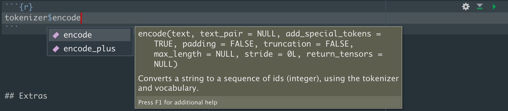

```{r, include = FALSE}
knitr::opts_chunk$set(
  collapse = TRUE,
  comment = "#>"
)
```

```{r setup, message=FALSE}
library(huggingfaceR)
library(dplyr)
library(stringr)
library(tidyr)
library(purrr)
```

# Introduction

This vignette is the second of a three-part set which aims at two
things:

1.  To get users new to Hugging Face's `transformers` library familiar
    with the three main abstractions:

    -   Pipelines

    -   Tokenizers

    -   Models

2.  To give users familiar with `transformers` a whistle-stop tour of
    the syntax they'll need to get started with each abstraction.

In this vignette we'll be looking at using tokenizers to ... tokenize(!)
batches of text.

# Loading a tokenizer

```{r}
model_id <- "distilbert-base-uncased"
tokenizer <- hf_load_tokenizer(model_id)
```

# Encoding Text

It's that simple, you can now use the tokenizer to encode your text. In
this case encoding means going from words/sub words to numbers. For
example:

```{r}
text <- "This is a test"
encoded_text <- tokenizer$encode(text)
encoded_text
```

# Decoding Text

You can also decode your encoded text, which is going from numbers back
to words and serves as a good sanity check. You'll see the addition of
some special tokens, in this case [CLS] and [SEP] which tell the model a
sequence is beginning and ending respectively.

```{r}
tokenizer$decode(encoded_text)
```

# Parallelism Warning Prevention

If the following warning message begins to spam your console, you can
use the code in the next chunk to prevent it.

> huggingface/tokenizers: The current process just got forked, after
> parallelism has already been used. Disabling parallelism to avoid
> deadlocks... To disable this warning, you can either: - Avoid using
> `tokenizers` before the fork if possible - Explicitly set the
> environment variable TOKENIZERS_PARALLELISM=(true \| false)

```{r}
library(reticulate)

py_run_string("import os")
py_run_string("os.environ['TOKENIZERS_PARALLELISM'] = 'false'")
```

Alternatively, you could use the argument `use_fast = FALSE` when
instantiating the tokenizer.

Instead of encoding your text variable, you could have simply called
your tokenizer on some text to return the input_ids and attention_mask:

```{r}
tokenizer("this is tokenisation")
```

If we try to tokenize a vector with length \> 1, we'll raise an error.
We'll use `stringr::sentences` and try to tokenize 720 sentences.

```{r, eval = FALSE}
tibble(sentences = stringr::sentences) %>%
  mutate(encoded = tokenizer$encode(sentences))
```

We can avoid this error by using the `purrr` `map()` function.

```{r}
encodings <- map(sentences, tokenizer$encode)

length(encodings)
```

We now have a 720 length list of encoded texts. If we wanted to, we
could have created a tibble and used `mutate()` and `map()` to add a
column of encoded texts to our tibble:

```{r}
encodings_df <- tibble(sentences = stringr::sentences) %>%
  mutate(encoded = map(sentences, tokenizer$encode))
```

We can see that each row of the encoded column is a list of input ids:

```{r}
encodings_df[1, 2]$encoded
```

# Ellipsis (three dots / triple dots / dot dot dot)

```{r}
?hf_load_tokenizer
```

You may have noticed that `hf_load_tokenizer` accepts `...`. This allows
you to provide an arbitrary number of arguments to the load tokenizer
function. Common arguments are `return_tensors = pt`,
`use_fast = TRUE/FALSE`, `padding = TRUE`, etc.

[link to tokenizer
docs](https://huggingface.co/docs/transformers/main_classes/tokenizer)

You can also use RStudio's helpful autofill feature to view the
arguments a tokenizer's encode method will accept (or any Python
method/function). Type out the method you want to see arguments for and
then press tab:



```{r}
tokenizer_slow <- hf_load_tokenizer(model_id, use_fast = FALSE)

c(tokenizer_slow$is_fast, tokenizer$is_fast)
```

# Extras

We can extract a lot of information from our tokenizer. For example, we
can look at all special tokens

-   [UNK] - unknown tokens - things the model does not recognise

-   [CLS] - Start of sequence/first position

-   [SEP] - Separates sentences (roughly speaking)

-   [PAD] - Padding for when sequence is shorter than model_max_length
    (input tensors must be of equal size)

-   [MASK] - Whether token should be hidden from model and thus
    predicted (for training model)

```{r}
tokenizer_slow$all_special_tokens
```

We can check our tokenizer's max accepted sequence length:

```{r}
tokenizer_slow$model_max_length
```

We can access our tokenizer's vocabulary:

```{r}
(vocab <- tibble(
  token = names(tokenizer$vocab),
  input_id = unlist(tokenizer$vocab, recursive = FALSE)
)) %>% 
  head(20)
```

# Session Info

```{r}
sessioninfo::session_info()
```
